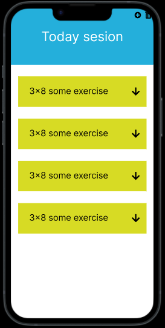
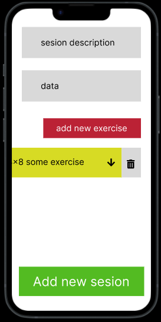

# My Sesion


# Sobre

**Projeto para auxiliar os treinos na academia.**

*exemplo: como realizar a execução do exercicio e quanta carga tem feito em cada em cada serie.*

# Layout

<div>




</div>
<div>




</div>

[Figma](https://www.figma.com/file/ekEy5JBoO15XJQ4ojHp6Wi/mySesion?node-id=0%3A1&t=FIK8g7ao98UpOPK6-1)

# Tecnologias utilizadas
## Front End
- Flutter

# Arquitetura
*Em breve*

# Como executar o projeto

**Pré-requisitos:**

    Flutter >= 3.3.10

    Dart >= 2.18.6

**No terminal**
```bash
    # clonar repositório
    git clone https://github.com/LRittes/my_sesion.git

    # entrar na pasta do projeto
    cd my_sesion

    # fazer download dos packages necessários
    flutter pub get

    # rodar o projeto
    flutter run
```

# Autor

**Leandro Ribeiro Rittes**

[GitHub](https://github.com/lrittes)

[Linkedin](https://www.linkedin.com/in/leandro-rittes/)
